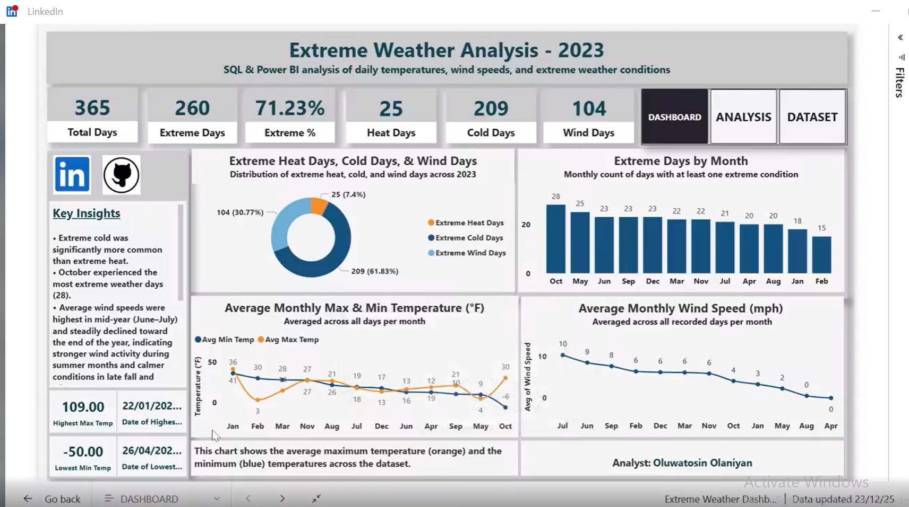
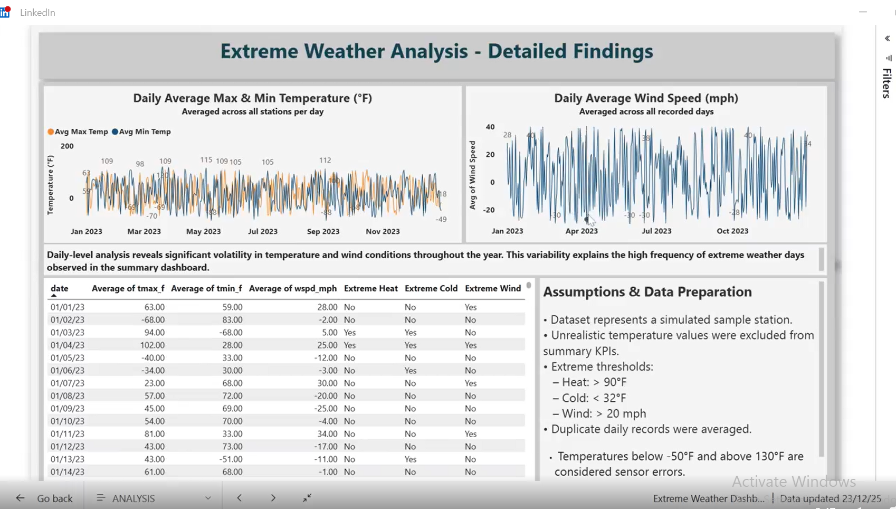
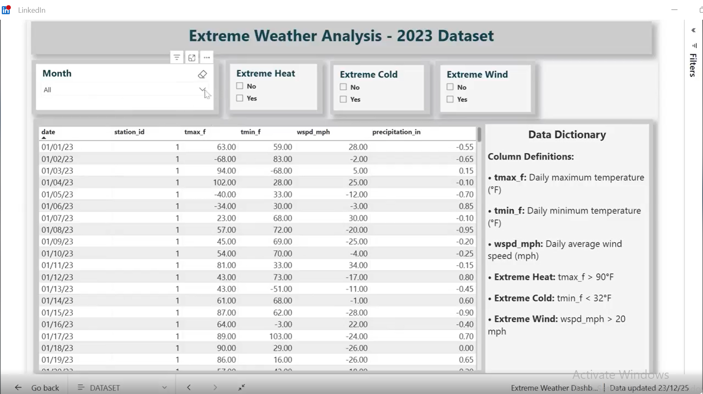

## Extreme Weather Analysis (SQL & Power BI)

## Project Overview
This project analyzes daily weather data to identify extreme temperature and wind conditions over a one-year period. Using SQL (SQLite) for data cleaning and analysis and Power BI for visualization, the project explores how frequently extreme weather occurs and how it changes over time. 

This project was completed as a **portfolio data analysis project** and served as my **first end-to-end Power BI dashboard**, with a strong focus on data preparation, analytical thinking, and storytelling. 

---

## Dataset 
- **Source:** Simulated weather dataset representing a single sample weather station
- **Granularity:** Daily observations
- **Time period:** 2023
- **Key variables:** 
  - Daily maximum temperature (°F)
  - Daily minimum (°F)
  - Average wind speed (mph) 
   Date

**Note:** 
The dataset is simulated and intentionally includes unrealistic values and duplicate records to support data cleaning practices rather than real-world forecasting. 

---

## Data Cleaning & Preparation (SQL)
Data preparation was performed using SQLite and included:

- Identified and handled duplicate records for the same station and date
- Checked for logical inconsistencies (e.g., minimum temperature higher than maximum temperature)
- Investigated unrealistic sensor values
- Created a cleaned SQL view for analysis while preserving the raw data
- Defined extreme weather thresholds: 
  - **Extreme Heat:** Maximum temperature > 90°F
  - **Extreme Cold:** Minimum temperature < 32°F
  - **Extreme Wind:** Wind speed > 20 mph

All assumptions were documented and applied consistently throughout the analysis. 

---

## Analysis & Visualization (Power BI)
The Power BI report is organized into three pages:

### 1. Dashboard (High-Level Overview)
- Total recorded days
- Extreme weather days and percentage
- Counts of extreme heat, cold, and wind days
- Monthly distribution of extreme weather events
- Monthly average temperature and wind trends

### 2. Analysis (Detailed Findings)
- Daily temperature volatility across the year
- Daily wind speed variability
- Comparison between aggregated trends and day-level extremes
- Contextual explanations for observed patterns
  
---

### 3. Dataset (Transparency View)
- Tabular view of cleaned daily records
- Flags for extreme heat, cold, and wind events
- Supports traceability from KPIs to raw observations

---

## Dashboard Preview

### Overview Dashboard

## Detailed Analysis

## Dataset View

---

## Key Findings
- **71%** of recorded days experienced at least one extreme weather condition
- Extreme cold days accounted for the largest share of extreme events
- Wind speeds peaked during mid-year, while temperature volatility persisted throughout the year
- Daily-level analysis revealed significant variability hidden by aggregated averages

## Tools & Technologies
- **SQL (SQLite):**  Data cleaning, validation, and aggregation
- **Power BI:** Data modeling, visualization, and storytelling
- **Git & GitHub:** Version control and portfolio hosting

---

## What I learned
- How to clean and validate real-world-like datasets
- How to define and document analytical assumptions
- How to balance summary-level insights with detailed analysis
- How to build clear, structured dashboards that answer specific questions
- How SQL and Power BI are integrated in an end-to-end analysis workflow

---

## Time Investment
This project took several days to complete, including:
 - Learning Power BI fundamentals
 - Iterative dashboard design and refinement
 - Data validation and assumption review
 - Documentation and portfolio preparation

---

## Project Structure
extreme-weather-analysis/
│
├── data/ # Dataset files
├── sql/ # SQL queries and cleaned views
├── powerbi/ # Power BI (.pbix) report
├── screenshots/ # Dashboard images
└── README.md
